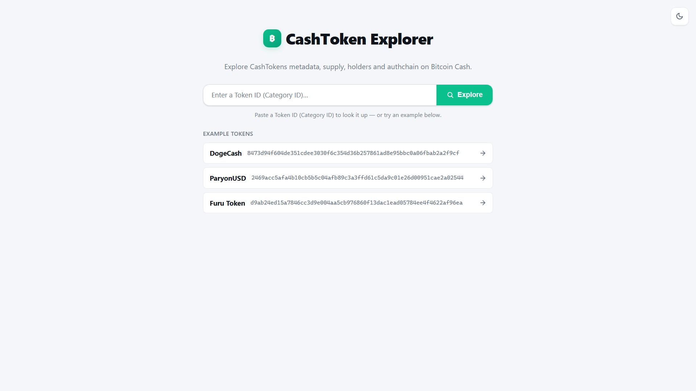
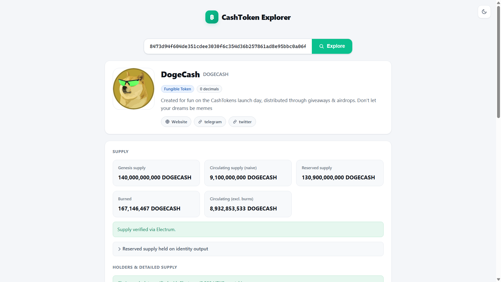
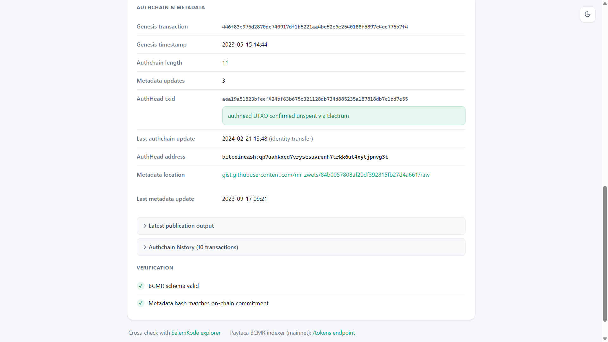

# CashToken Explorer

This is the code repository for [tokenexplorer.cash](https://tokenexplorer.cash/). Explore CashTokens metadata, supply, holders and authchain on Bitcoin Cash (mainnet & chipnet).

## Features

The token explorer shows a token's BCMR metadata and on-chain info: the genesis supply of FTs, the number of NFTs, active minting NFTs, circulating & reserved supply of FTs, holder counts, the location of the authHead, the location of the metadata file, the authChain length, the number of metadata updates and whether the metadata hash matches.

The interface has a clean card-based layout with light & dark mode, and the home page lists example tokens to explore.

It's also a handy tool for token creators, who can use the "Verification" checks to confirm their token's BCMR metadata is valid, correctly hashed on-chain, and properly registered.

Take a look at [the token info of DogeCash](https://tokenexplorer.cash/?tokenId=8473d94f604de351cdee3030f6c354d36b257861ad8e95bbc0a06fbab2a2f9cf) as an example.

## How the data is fetched

On-chain token info (the genesis transaction, genesis supply of FTs, active minting UTXOs, holders and the authchain) is queried from [Chaingraph](https://chaingraph.cash/). The Chaingraph instance defaults to a [public instance](https://gql.chaingraph.pat.mn/v1/graphql) but is configurable via the `NEXT_PUBLIC_CHAINGRAPH_URL` environment variable.

Because a Chaingraph instance can serve stale UTXO data (reporting already-spent UTXOs as unspent), the reserved and circulating supply are cross-verified against Electrum Cash servers, which talk to full nodes directly. Electrum is used to confirm which of Chaingraph's UTXOs are actually still unspent; if the two disagree, Electrum's view is used and the discrepancy is surfaced in the UI. Electrum verification is non-blocking: if it fails, the explorer falls back to Chaingraph data labelled as unverified.

## How it was made

The project was started from the [mainnet-js React-next](https://github.com/mainnet-cash/mainnet-js/tree/master/demo/react-next) example.
[Mainnet-js](https://mainnet.cash/) is used to import onchain linked Bitcoin Cash Metadata Registries (BCMR).
