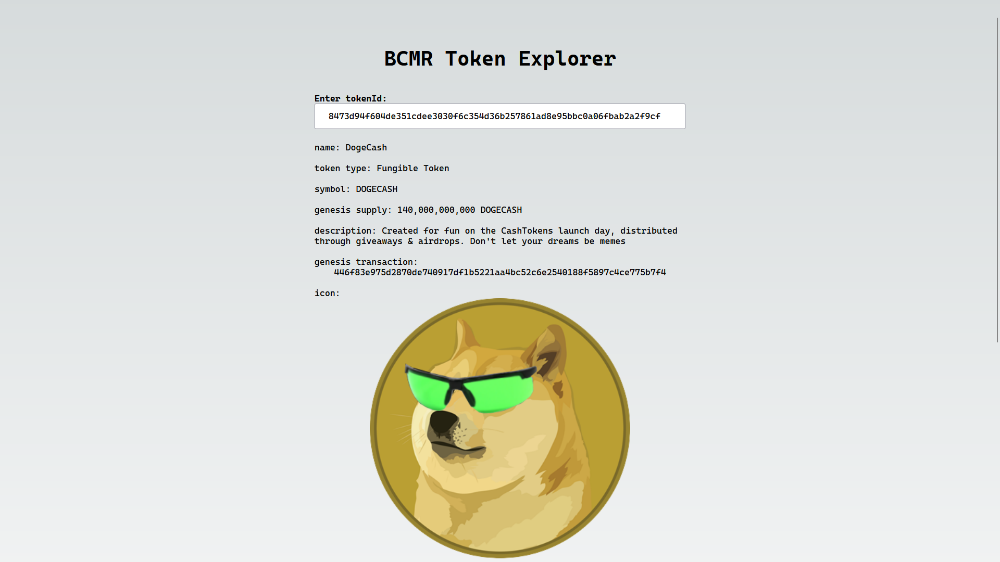

# BCMR Token Explorer

This is the code repository for [tokenexplorer.cash](https://tokenexplorer.cash/), a BCMR token explorer for CashTokens on Bitcoin Cash mainnet & chipnet.

## Features

The token explorer shows the tokens BCMR metadata and onchain info: the genesis supply of FTs, the number of NFTs, active minting NFTs, circulating & reserved supply of FTs, the location of the authHead, the location of the metadata file, the authChain length, the number of metadata updates and whether the metadata hash matches.

Take a look at [the token info of DogeCash](https://tokenexplorer.cash/?tokenId=8473d94f604de351cdee3030f6c354d36b257861ad8e95bbc0a06fbab2a2f9cf) as an example.

## How it was made

The project was started from the [mainnet-js React-next](https://github.com/mainnet-cash/mainnet-js/tree/master/demo/react-next) example.
[Mainnet-js](https://mainnet.cash/) is used to import onchain linked Bitcoin Cash Metadata Registries (BCMR).
A [public chaingraph instance](https://gql.chaingraph.pat.mn/v1/graphql) is used to query on-chain token info such as the genesis transaction, the genesis supply of FT and active minting UTXOs.